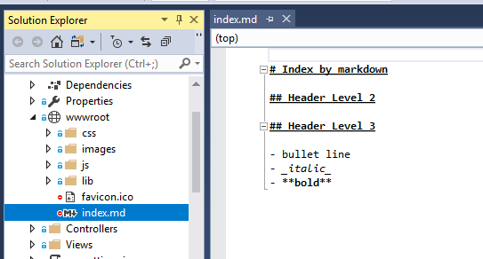
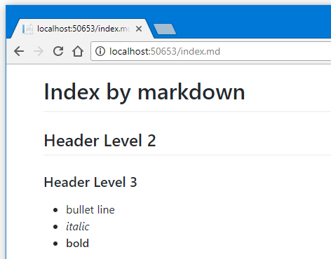

# Toolbelt.AspNetCore.MarkdownPages [](https://www.nuget.org/packages/Toolbelt.AspNetCore.MarkdownPages/)

Transform "text/markdown" response to HTML in ASP.NET Core application.

## How to use

### Install Package

```powershell
# Package manager Console
PM> Install-Package Toolbelt.AspNetCore.MarkdownPages
```

or

```bash
# .NET CLI
$ dotnet add package Toolbelt.AspNetCore.MarkdownPages
```

### Enable "Markdown Pages" feature

At `Configure` method in `Startup` class, call `UseMarkdownPages()` extension method **before** middle wares that responding "text/markdown" contnets.

```csharp
using Toolbelt.AspNetCore.MarkdownPages;
...
class Startup {
  public void Configure(IApplicationBuilder app){
    ...
    app.UseMarkdownPages();
    ...
    app.UseStaticFiles();
    ...
    app.UseMvc();
  }
}
```

After that, all responses which contntent type is "text/markdown" - not only static files but also MVC view result - are transform from markdown syntax text to HTML pages on the fly.





### Inject custom CSS files

You can inject CSS file when calling `UseMarkdownPages()` method with options.

```csharp
  app.UseMarkdownPages(new MarkdownPagesOptions {
    CssLinks = {
      "/path/to/css-file1.css",
      "/path/to/css-file2.css",
      ...
    }
  });

```


## License

[Mozilla Public License 2.0](LICENSE)